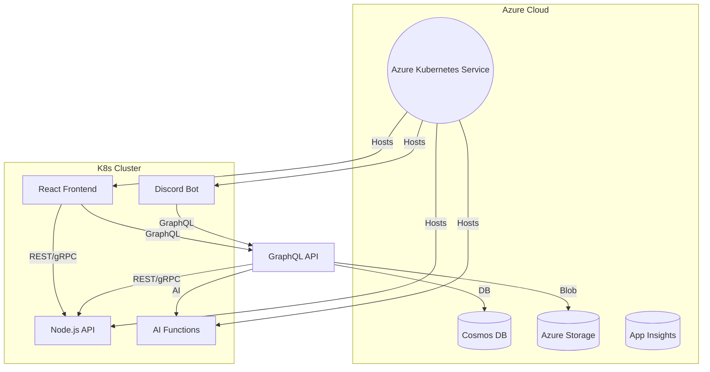
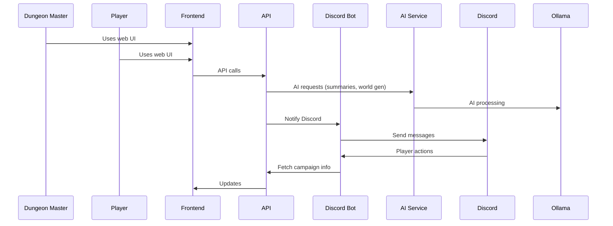

# D&D Campaign Organizer

A modern, cloud-native D&D campaign organizer for Dungeon Masters and players, featuring:
- **React** frontend
- **Node.js** microservices (REST and/or GraphQL API)
- **AI integration** (Ollama)
- **GraphQL API** for flexible data access
- **Discord bot** for player/world interaction
- **Azure** cloud services
- **Kubernetes** orchestration

---

## Features
- World-building tools (locations, NPCs, lore, maps)
- Idea boards and session planners
- Session recording and AI-generated summaries
- Campaign and character management
- Discord integration for player interaction
- AI helpers for world/quest/NPC generation

---

## Architecture Overview

### System Component Diagram


### User/System Interaction Sequence


---

## GraphQL in This Project

This project supports GraphQL as a flexible API layer for both the frontend and Discord bot. GraphQL enables clients to request exactly the data they need, making it ideal for complex, nested D&D campaign data.

**Key Points:**
- The GraphQL API can be implemented in Node.js using your preferred server (e.g., Apollo Server, Yoga, etc.).
- The GraphQL server acts as a gateway, aggregating data from microservices (AI, storage, etc.) and databases.
- Both the React frontend and Discord bot can use GraphQL queries and mutations.
- GraphQL is containerized and deployed to Kubernetes like other services.

**Example Schema (for illustration):**
```graphql
type Campaign {
  id: ID!
  name: String!
  sessions: [Session!]!
  npcs: [NPC!]!
}
type Query {
  campaigns: [Campaign!]!
  campaign(id: ID!): Campaign
}
type Mutation {
  createCampaign(name: String!): Campaign
}
```

**Benefits:**
- Flexible, strongly-typed API for all clients
- Single endpoint for complex, nested data
- Easy integration with microservices and AI features

---

## Tech Stack
- **Frontend**: React, TypeScript, Material-UI/Chakra UI
- **Backend/API**: Node.js, Express, GraphQL (Apollo Server/Yoga/etc.)
- **AI Service**: Node.js, Ollama API
- **Discord Bot**: Node.js, discord.js
- **Database**: Azure Cosmos DB
- **Storage**: Azure Blob Storage
- **Orchestration**: Docker, Kubernetes (AKS)
- **CI/CD**: GitHub Actions or Azure Pipelines

---

## Roadmap

- [x] **1. Plan the Architecture** ✅
- [x] **2. Set Up Monorepo (Turborepo)** ✅
- [x] **3. Scaffold Services (frontend, backend, bot)** ✅
- [x] **4. Basic Discord Bot Integration** ✅
- [x] **5. Process Management & Port Management** ✅
- [x] **6. VS Code Development Environment** ✅
- [x] **7. GraphQL API Setup** ✅
- [ ] **8. Dockerize Each Service**
- [ ] **9. Write Kubernetes Manifests**
- [ ] **10. Set Up Azure Resources (AKS, ACR, Cosmos DB, Storage)**
- [ ] **11. Set Up CI/CD**
- [ ] **12. Implement Core D&D Features**
- [ ] **13. Secure and Configure (Secrets, ConfigMaps, Auth)**
- [ ] **14. Test and Iterate**

---

## Directory Structure (Suggested)
```
/ (root)
  /apps
    /frontend      # React app
    /api           # Node.js/Express API
    /discord-bot   # Discord bot
    /ai-functions  # AI microservices
  /packages
    /shared        # Shared types, utils
  /infra           # IaC scripts for Azure
  README.md
  package.json
  turbo.json / nx.json
```

---

## Quick Start

### Running All Services Locally

1. **Clone the repo and install dependencies:**
   ```bash
   git clone <your-repo-url>
   cd "React with Azure"
   npm install
   ```

2. **Set up environment variables:**
   - Create `apps/api/.env` with your API configuration
   - Create `apps/discord-bot/.env` with your Discord bot token

3. **Start all services:**
   ```bash
   # Option 1: Using npm script
   npm run dev:all
   
   # Option 2: Using PowerShell script
   .\scripts\start-all.ps1
   
   # Option 3: Double-click the batch file
   start-all.bat
   ```

4. **Access the services:**
   - Frontend: http://localhost:5173
   - API: http://localhost:4000
   - GraphQL Playground: http://localhost:4000/graphql
   - Discord Bot: Running and responding to `!ping`

### Individual Services

- **Frontend only:** `npm run dev --filter=frontend`
- **API only:** `npm run dev --filter=api`
- **Discord Bot only:** `npm run dev --filter=discord-bot`

## Production Setup

1. **Set up Azure resources** (AKS, ACR, Cosmos DB, Storage)
2. **Configure environment variables and secrets**
3. **Build and push Docker images**
4. **Deploy to AKS using Kubernetes manifests**
5. **Set up Discord bot and connect to your server**
6. **Start building your campaign!**

---

## Contributing
Pull requests and suggestions welcome! Please open an issue to discuss your ideas.

---

## License
MIT 

---

## Finalized Architecture Decisions

| Area                | Choice/Tool           | Notes |
|---------------------|----------------------|-------|
| GraphQL Server      | Apollo Server        | Popular, TypeScript-friendly |
| Authentication      | Azure AD             | Native Azure integration |
| Database            | Azure Cosmos DB      | Scalable, NoSQL, Azure-native |
| Event-Driven        | Add later            | Start with REST/GraphQL |
| API Gateway/Ingress | Basic K8s Ingress    | Upgrade as needed |
| CI/CD               | GitHub Actions       | Simple, integrates with GitHub |
| UI Library          | Material-UI          | Popular React UI library |
| Other Enhancements  | Add later            | Service mesh, caching, etc. |

These decisions provide a solid, scalable foundation for the project. Optional enhancements (event-driven, service mesh, caching, multi-tenancy, etc.) can be added as the project grows. 