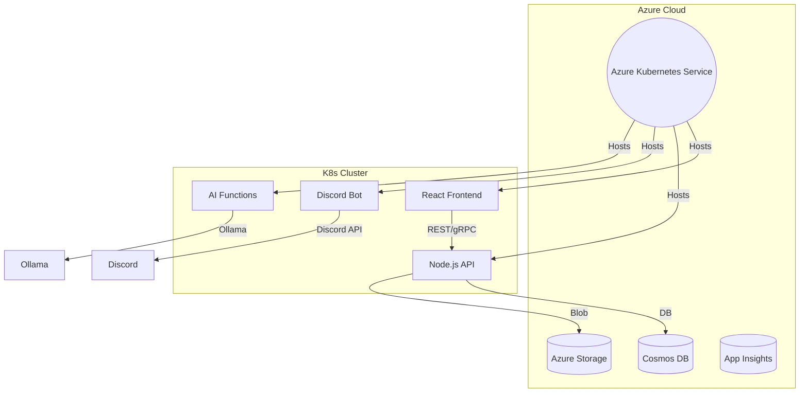
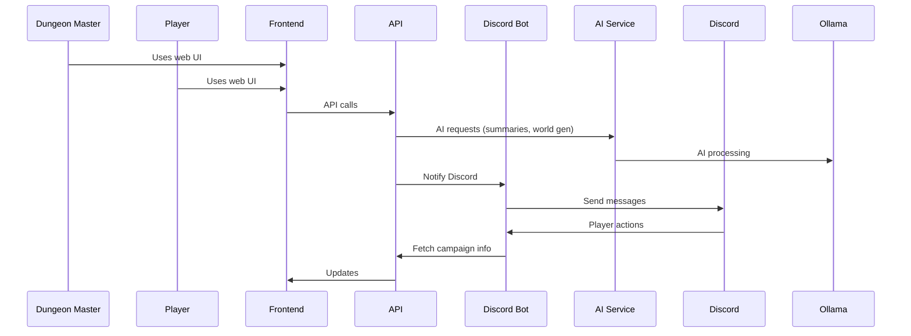

# D&D Campaign Organizer

A modern, cloud-native D&D campaign organizer for Dungeon Masters and players, featuring:
- **React** frontend
- **Node.js** microservices
- **AI integration** (Ollama)
- **Discord bot** for player/world interaction
- **Azure** cloud services
- **Kubernetes** orchestration

---

## Features
- World-building tools (locations, NPCs, lore, maps)
- Idea boards and session planners
- Session recording and AI-generated summaries
- Campaign and character management
- Discord integration for player interaction
- AI helpers for world/quest/NPC generation

---

## Architecture Overview

### System Component Diagram


### User/System Interaction Sequence


---

## Tech Stack
- **Frontend**: React, TypeScript, Material-UI/Chakra UI
- **Backend/API**: Node.js, Express
- **AI Service**: Node.js, Ollama API
- **Discord Bot**: Node.js, discord.js
- **Database**: Azure Cosmos DB
- **Storage**: Azure Blob Storage
- **Orchestration**: Docker, Kubernetes (AKS)
- **CI/CD**: GitHub Actions or Azure Pipelines

---

## Roadmap

1. **Plan the Architecture**
2. **Set Up Monorepo** (Turborepo/Nx)
3. **Scaffold Services** (frontend, backend, bot, AI)
4. **Dockerize Each Service**
5. **Write Kubernetes Manifests**
6. **Set Up Azure Resources** (AKS, ACR, Cosmos DB, Storage)
7. **Set Up CI/CD**
8. **Implement Core Features**
9. **Secure and Configure** (Secrets, ConfigMaps, Auth)
10. **Test and Iterate**

---

## Directory Structure (Suggested)
```
/ (root)
  /apps
    /frontend      # React app
    /api           # Node.js/Express API
    /discord-bot   # Discord bot
    /ai-functions  # AI microservices
  /packages
    /shared        # Shared types, utils
  /infra           # IaC scripts for Azure
  README.md
  package.json
  turbo.json / nx.json
```

---

## Setup Instructions

1. **Clone the repo and install dependencies**
2. **Set up Azure resources** (AKS, ACR, Cosmos DB, Storage)
3. **Configure environment variables and secrets**
4. **Build and push Docker images**
5. **Deploy to AKS using Kubernetes manifests**
6. **Set up Discord bot and connect to your server**
7. **Start building your campaign!**

---

## Contributing
Pull requests and suggestions welcome! Please open an issue to discuss your ideas.

---

## License
MIT 